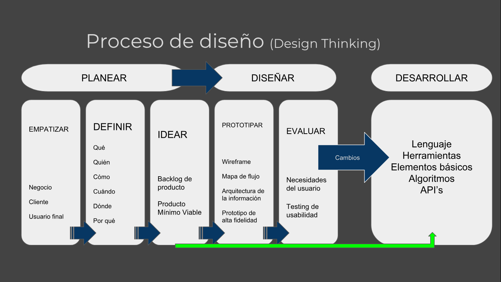
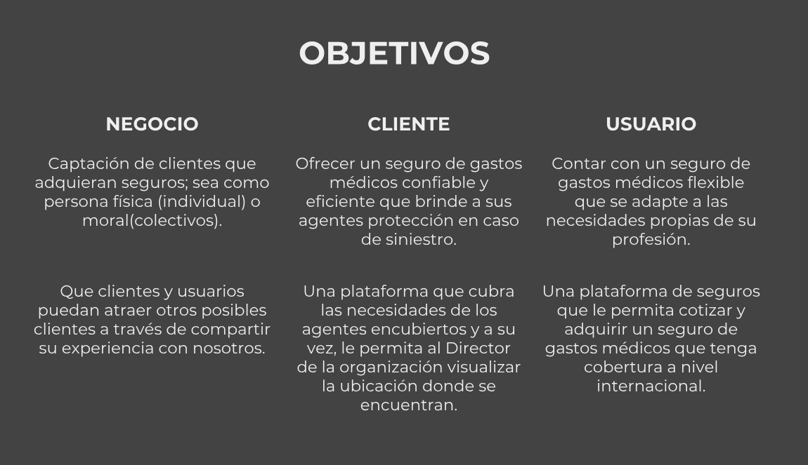
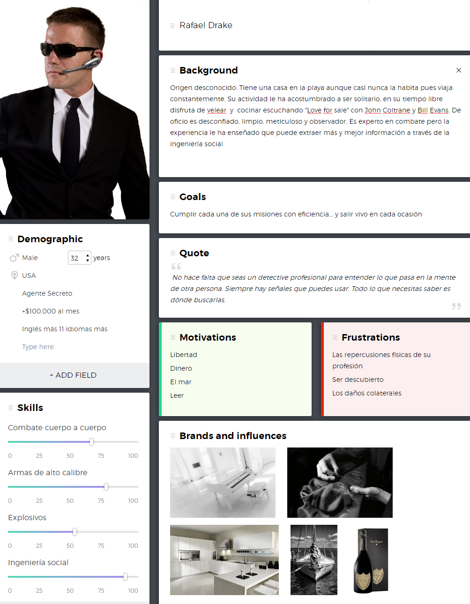
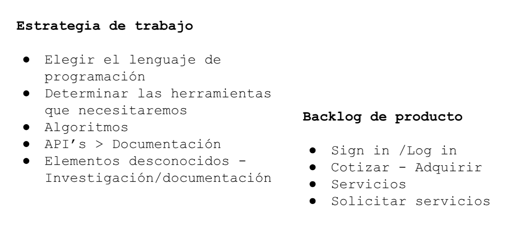
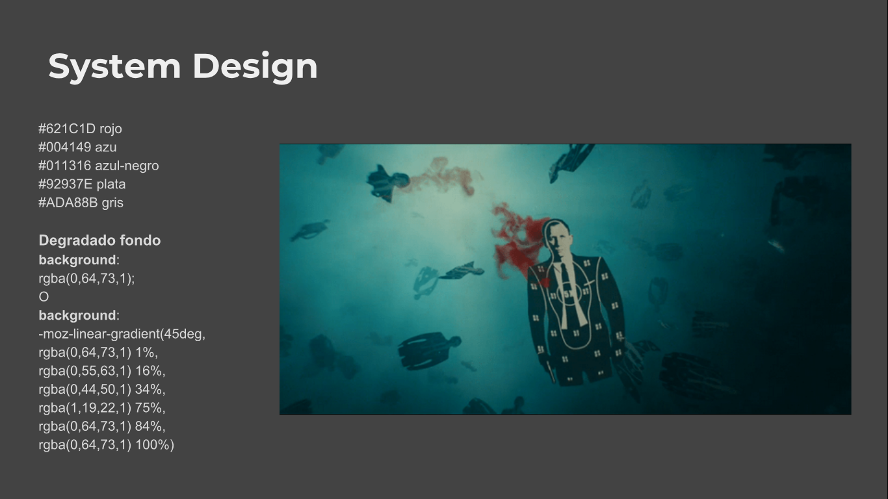

# SAFEGUARD

Reto de Axa para el Talent Fest de Laboratoria.
Aplicación móvil de Gastos Médicos exclusiva para Agentes Encubiertos.

## El Reto

Desarrollar una aplicación móvil en 36 horas en la cual, un agente encubierto pueda cotizar su Seguro de Gastos Médicos (SGM).

## Proceso

## Los objetivos

## Un usuario muy particular

## Estrategia

## Diseño

